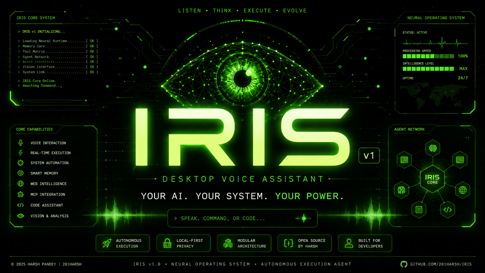

<div align="center">



### Voice-First Desktop AI Assistant

**Build Faster. Automate Workflows. Control your Desktop with Voice Commands.**

---

<div style="display: flex; justify-center; gap: 10px; margin-bottom: 20px;">

  <a href="https://github.com/IRISX-AI/IRIS-AI/stargazers">
    
  </a>

  <a href="https://github.com/IRISX-AI/IRIS-AI/network/members">
    
  </a>

  <a href="https://github.com/IRISX-AI/IRIS-AI/graphs/contributors">
    
  </a>

  <a href="https://github.com/IRISX-AI/IRIS-AI/releases">
    
  </a>

  <a href="https://github.com/sponsors/201Harsh">
    
  </a>

</div>

**Speak your command. IRIS executes it.**

A voice-first neural execution system powered by **Gemini 3.1 Live API** with real-time WebRTC audio, biometric security, and autonomous system control.

---

</div>

# 📑 Table of Contents

- [⚡ Overview](#-overview)
- [🎯 What is Voice-First?](#-what-is-voice-first)
- [✨ Core Features](#-core-features)
- [🔐 Code Protection & Security](#-code-protection--security)
- [💰 Sponsorship Tiers](#-sponsorship-tiers)
- [🏗️ Architecture](#️-architecture)
- [💻 Tech Stack](#-tech-stack)
- [🚀 Installation & Setup](#-installation--setup)
- [📁 Project Structure](#-project-structure)
- [🧠 Development Philosophy](#-development-philosophy)
- [🤝 Contributing](#-contributing)
- [🧩 Extending IRIS](#-extending-iris)
- [🧠 Roadmap](#-roadmap)
- [⚠️ Disclaimer](#️-disclaimer)
- [👨‍💻 Architect](#-architect)
- [📜 License](#-license)

---

# ⚡ Overview

IRIS is not a chatbot.

It is a **Voice-First Desktop AI Assistant** that executes real-world actions across your system, applications, and devices—powered by **Gemini 3.1 Live API** with real-time bidirectional audio processing.

> **Speak naturally. IRIS understands intent. Real actions execute instantly.**

## What Makes IRIS Different?

✅ **Voice-First Design** – Optimized for natural speech input with real-time WebRTC audio streaming  
✅ **Proprietary Agent Logic** – Heavily protected, production-grade agentic orchestration  
✅ **Production-Ready Security** – V8 bytecode + ASAR integrity validation + window isolation  
✅ **No Code Exposure** – Core agent and tools are completely hidden from public source  
✅ **Autonomous Execution** – LangGraph-powered state machine with dynamic tool orchestration

---

# ✨ What's New In v1.5.1

- Rebuilt voice architecture using Gemini Live SDK
- Removed legacy WebSocket-heavy communication layer
- Improved voice responsiveness and stability
- Refactored tool execution pipeline
- Improved memory handling
- Improved vision support
- Cleaner Electron-native architecture
- Foundation for future premium modules
- Updated branding and documentation

---

# 🪡 Open Core Model

### IRIS follows an Open Core development model.

**The public repository includes**:

- Desktop application framework
- User interface
- Core infrastructure
- Selected integrations
- Community-facing examples

The following production components are private:

- Core voice orchestration engine
- Advanced tool execution logic
- Internal automation systems
- Production-grade implementations
- Certain premium modules

GitHub Sponsors receive access to additional documentation, implementation examples, architecture breakdowns, and development resources depending on tier.

**Sponsorship does not include access to the complete private source code.**

---

# 🎯 What is Voice-First?

Traditional AI assistants are **text-first**: you type → they respond → you read.

IRIS is **voice-first**: you speak → they listen & execute → actions happen in real-time.

### Real-Time Audio Processing

```
Your Voice
    ↓ (WebRTC Stream)
Gemini 3.1 Live API (Real-time)
    ↓ (Intent Recognition)
LangGraph Agent Orchestration
    ↓ (Tool Selection)
Protected Tool Execution
    ↓ (System Actions)
Results Streamed Back to You
```

- **Latency:** < 500ms end-to-end (including network)
- **Quality:** Full duplex (talk while agent responds)
- **Models:** Gemini 3.1 Live API (primary) + Groq (Fast Responses) + Hugging Face (Open-Sourced + Local Models)
- **Search:** Tavily for real-time web data

No local-only limitations. IRIS connects to **cloud AI, search engines, and APIs** for maximum intelligence.

---

# ✨ Core Features & System Capabilities

### 📂 System & File Management

- 🖥️ **Open App:** Native application lifecycle control
- 🛑 **Close App:** Instant process termination
- 🗂️ **Read Directory:** Local folder scanning & indexing
- 📁 **Create Folder:** Instant directory structure generation
- 📄 **Read File:** Deep text & code extraction
- 📝 **Write File:** Autonomous disk write access
- 🔄 **Manage File:** Copy, move, and delete control
- 🚀 **Open File:** Native OS application launcher
- 🗃️ **Smart Drop Zones:** Viral, autonomous folder sorting

### 🧠 Vector Search & Local Knowledge

- 🔍 **Index Folder:** Semantic LanceDB directory ingestion
- 🔎 **Smart File Search:** Vector-based local file retrieval
- 🖼️ **Read Gallery:** Local image cache scanning
- 👁️ **Analyze Photo:** Direct multimodal vision processing

### 💻 Developer & Terminal Tools

- ⌨️ **Run Terminal:** Native shell & CLI execution
- 🛠️ **Open Project:** Instant IDE workspace loading
- ⚙️ **Activate Protocol:** Context-aware coding mode switch
- 🏗️ **Build File:** Writing code directly to disk
- 🤖 **Execute Sequence:** JSON-based macro automation runs
- ▶️ **Execute Macro:** Named workflow sequence triggering
- 🕳️ **Deploy Wormhole:** Expose localhost to public internet
- 🛑 **Close Wormhole:** Terminate public localhost tunnels

### 🎯 Desktop UI, Vision & Automation

- 🪟 **Teleport Windows:** Dynamic desktop window management
- 🧩 **Create Widget:** Spawn live floating desktop components
- ❌ **Close Widgets:** Clear active floating overlays
- 🖱️ **Click on Screen:** AI-driven exact coordinate targeting
- 📜 **Scroll Screen:** Autonomous up/down page navigation
- ⚡ **Press Shortcut:** Global keyboard hotkey injection
- 👻 **Phantom Typer:** Global inline clipboard injection
- ✂️ **Screen Peeler (OCR):** Instant UI-to-code visual extraction
- ⌨️ **Ghost Coder:** Inline IDE generation (`Ctrl+Alt+Space`)
- 🔊 **Set Volume:** Master audio level control
- 📸 **Take Screenshot:** Instant visual context capture

### 💾 Memory & Information

- 🧠 **Save Core Memory:** Deep persistent identity tracking
- 📥 **Retrieve Memory:** Instant past context recall
- 📝 **Save Note:** Local markdown note generation
- 📖 **Read Notes:** Instant saved plan retrieval
- 📧 **Read Emails:** Gmail inbox scraping & summarization

### 🌐 Web, Media & Financials

- 🔍 **Google Search:** Live internet data retrieval (via Tavily)
- 🌤️ **Get Weather:** Real-time atmospheric condition checks
- 🗺️ **Open Map:** Interactive dark-mode map loading
- 🚗 **Get Navigation:** Real-time routing and directions
- 🎵 **Play Spotify:** Instant music & playlist execution
- 📈 **Stock Price:** Real-time financial ticker tracking
- 📊 **Compare Stocks:** Dual-ticker fundamental market analysis
- 🕷️ **Hack Live Website:** Viral visual DOM manipulation
- 🎨 **Build Animated Web:** Agentic Tailwind & GSAP generation
- 🖼️ **Generate Image:** High-fidelity multimodal media generation

### 💬 Communications

- 📲 **Send WhatsApp:** Instant automated message dispatch
- 🕒 **Schedule WhatsApp:** Cron-based delayed message automation
- 📧 **Draft Email:** Autonomous message composition
- 🚀 **Send Email:** Action-oriented direct dispatch

### 📱 Mobile Telekinesis (Deep Android Link)

- 🔔 **Mobile Notifications:** Read texts from connected phone
- 🔋 **Mobile Info:** Battery & hardware telemetry tracking
- 📤 **Push File to Mobile:** Seamless PC-to-phone transfers
- 📥 **Pull File from Mobile:** Instant phone-to-PC fetching
- 📱 **Open Mobile App:** Remote Android application launching
- 🛑 **Close Mobile App:** Remote Android process killing
- 👆 **Tap Mobile Screen:** Remote coordinate touch execution
- 📜 **Swipe Mobile Screen:** Remote directional scrolling control
- ⚙️ **Toggle Hardware:** Remote Wi-Fi/Bluetooth/Flashlight switching

### 🕵️ Autonomous Research & Deep RAG

- 🕸️ **Deep Research:** Autonomous Llama 3 web crawling
- 📓 **Read Notion Reports:** Deep sync with Notion databases
- 📚 **Ingest Codebase:** Deep local project Vector embedding
- 🔮 **Consult Oracle:** Deep local codebase RAG queries

### 🔐 Security & OS Vault

- 🔒 **Lock System Vault:** Standard PIN OS lockdown protocol
- 🛡️ **Biometric Encryption:** Multi-face recognition OS lockdown

---

# 🔐 Code Protection & Security

## ⚠️ Important: Core Code is Protected

IRIS uses **enterprise-grade code protection** to secure proprietary agent logic and tool implementations:

### What is Protected?

✅ **Agent Core** (`iris-ai.ts`)  
✅ **Tool Implementations** (`tools.ts`)  
✅ **IPC Handlers** (`handlers.ts`)  
✅ **System Utilities** (All Main Process code)

### How It's Protected?

1. **V8 Bytecode Compilation**
   - TypeScript → JavaScript → Binary V8 bytecode
   - Result: `.jsc` files (unreadable, machine-specific)
   - Reverse engineering: 100+ hours of effort

2. **Protected Strings Obfuscation**
   - Sensitive strings transformed to obfuscated functions
   - Example: System prompts, tool definitions, API patterns
   - Grep/string search returns nothing useful

3. **ASAR Integrity Validation**
   - SHA256 hashing at build time
   - Runtime validation at app startup
   - Tampering detection: **App crashes immediately**

4. **Window Isolation**
   - Renderer windows cannot directly access each other
   - All inter-process communication via secure IPC bridge
   - No Node.js in renderer process

### Security Guarantees

- **100% BYOK** (Bring Your Own Key) – Your API keys, your control
- **Local Encryption** – Keys stored in OS keychain, never transmitted
- **Zero-Trust Architecture** – All inputs validated, outputs sanitized
- **No External Validation** – Core logic never phones home

---

# 💰 Sponsorship Tiers

IRIS is built on open-source principles, but the **core agent logic and proprietary tools are hidden** to protect intellectual property and fund development.

## 🎁 Free Tier (Public Repository)

**What You Get:**

- Public source code (UI, integrations, setup)
- Ready-to-run desktop application (`npm run dev`)
- Community documentation
- Public GitHub issues & discussions
- Basic example tool signatures

**What You DON'T Get:**

- Full agent implementation (protected)
- Complete tool source code
- Advanced configuration docs
- Priority support

**Cost:** FREE ✅

---

# 💰 Sponsorship Tiers

IRIS is built on open-source principles, but the **core voice engine, agent loops, and advanced execution tools are hidden** within private repositories to protect intellectual property and fund ongoing development.

Review the options below to choose your access level and support the ecosystem.

---

## 🎁 Free Tier (Public Repository)

The baseline public repository contains the foundational UI layer, layout configuration, and basic ecosystem scaffolding.

- **What is Included:** Access to the public frontend shell (React + Tailwind + Framer Motion), community documentation, public GitHub issue tracking, and basic structural templates.
- **What is Locked:** Full agent execution routines, the core voice module, deep automation tool logic, and local self-hosting capability.
- **Monthly Cost:** Free

---

## 🟢 IRIS Supporter ($5/month)

Directly back the future of the IRIS ecosystem and unlock standard project insight.

- **GitHub Sponsor Badge:** Displays a verification badge on your public GitHub profile.
- **Sponsor-Only Updates:** Direct access to private text updates regarding upcoming system builds.
- **Development Progress Reports:** Behind-the-scenes engineering logs showing what is being cooked next.
- **Monthly Project Summaries:** Comprehensive recaps of system changes, optimizations, and performance stats.
- **Monthly Cost:** $5/month (USD)
- **Access Link:** [Sponsor @201Harsh on GitHub](https://github.com/sponsors/201Harsh)

---

## ⚡ IRIS Insider ($15/month)

Step closer to the codebase with private repository access and deep architectural insights.

- **Private Repository Access:** Full read access to the `iris-insiders` repository containing working functional code snippets for core agent hooks.
- **Early Development Previews:** See upcoming UI elements and feature modules weeks before public release.
- **Architecture Discussions:** Participate in private development threads discussing system performance and state management.
- **Behind-the-Scenes Progress:** Unfiltered access to video showcases and performance benchmarks of current builds.
- **Experimental Showcases:** Early look at how the voice processing pipeline handles background noise filtration.
- **Monthly Cost:** $15/month (USD)
- **Access Link:** [Sponsor @201Harsh on GitHub](https://github.com/sponsors/201Harsh)

---

## 🚀 IRIS Builder ($30/month)

Designed for developer-level sponsors who want to experiment with custom setups and prototype structures.

- **Access to Iris-Labs:** Direct membership to the `iris-labs` repository for code sharing and component testing.
- **Experimental AI Agents:** Access to unreleased experimental agent logic scripts and prompt testbeds.
- **Prototype Systems:** Early-stage UI widgets, window managers, and terminal interaction mockups.
- **Technical Development Logs:** Deep-dive logs exploring lower-level Electron execution, IPC communication, and V8 bytecode compilation tricks.
- **Alpha Feature Testing:** Opportunities to run partial standalone builds of upcoming tooling systems.
- **Advanced Architecture Breakdowns:** Full block diagrams and technical write-ups detailing the communication between backend processes.
- **Monthly Cost:** $30/month (USD)
- **Access Link:** [Sponsor @201Harsh on GitHub](https://github.com/sponsors/201Harsh)

---

## 👁️ IRIS Alpha Access ($50/month)

The definitive sponsor tier. Get absolute proximity to the latest builds, edge implementations, and direct development feedback priority.

- **Access to Iris-Alpha:** Exclusive membership to the bleeding-edge `iris-alpha` environment.
- **Early Alpha Builds:** Downloadable compiled packages of upcoming desktop application releases for early testing.
- **Upcoming Feature Previews:** Full access to high-tier closed tools (including advanced automated web navigation and cross-device mobile pairing prototypes).
- **Private Release Notes:** Granular, code-level changelogs tracking every structural patch.
- **Priority Sponsor Feedback:** Direct consideration for your feature requests, tool ideas, and framework optimizations.
- **Monthly Cost:** $50/month (USD)
- **Access Link:** [Sponsor @201Harsh on GitHub](https://github.com/sponsors/201Harsh)

---

## Why This Model?

```
Open Source + Sustainable Development

┌─────────────────────────────┐
│ Free Tier Users             │
│ (Community, feedback)       │
└──────────┬──────────────────┘
           │
    ┌──────▼───────┐
    │ Sponsors     │
    │ Fund Dev     │
    │ Get snippets │
    └──────┬───────┘
           │
    ┌──────▼──────────┐
    │ Enterprise      │
    │ Full access     │
    │ Support + mods  │
    └─────────────────┘
```

---

# 🏗️ Architecture

### Frontend (React)

- UI, widgets, visualizations
- Voice input/output handling
- Real-time metrics display

### Backend (Electron Main Process) - **PROTECTED**

- LangGraph agent orchestration
- Tool execution engine
- Protected by V8 bytecode + ASAR

### IPC Bridge (Secure)

```typescript
// Frontend
window.electron.ipcRenderer.invoke('tool-name', payload)

// Backend (Protected)
ipcMain.handle('tool-name', async (event, payload) => {
  // Secure tool execution
})
```

### AI Integration

- **Gemini 3.1 Live API** – Real-time voice processing
- **Groq API** – Ultra-fast inference fallback
- **Hugging Face** – Local model support
- **Tavily** – Web search & research

---

# 💻 Tech Stack

### 🖥️ Core Desktop & UI Framework

- **Electron & Vite:** High-performance desktop compilation
- **React 19:** Component-based frontend
- **Tailwind CSS v4:** Utility-first styling
- **Framer Motion & GSAP:** Hardware-accelerated animations
- **Three.js & React Three Fiber:** 3D neural visualizations
- **Zustand:** Global state management

### 🧠 AI & Agent Layer (PROTECTED)

- **Google Gemini 3.1 Live API:** Primary reasoning engine + WebRTC audio
- **Groq SDK:** Ultra-fast inference routing
- **LangGraph:** Agentic state orchestration (protected)
- **Hugging Face:** Local model inference
- **LanceDB:** Vector database for RAG & memory

### 🔐 Security & Protection

- **V8 Bytecode:** Code compilation to binary (unreadable)
- **ASAR Integrity:** Package validation + tampering detection
- **electron-vite:** Secure split-process architecture
- **Context Isolation:** Renderer/Main process separation

### ⚙️ OS Control & Automation

- **Nut.js:** Desktop automation (mouse, keyboard, coordinates)
- **Puppeteer + Stealth:** Headless browser & web automation
- **Node Window Manager:** Window lifecycle control
- **Tesseract.js:** OCR for visual extraction
- **Native Utilities:** Audio, clipboard, screenshots

### 🔗 Integrations

- **Google APIs & Auth:** Gmail, Google Cloud
- **Notion Client:** Database sync
- **Tavily Core:** Web search
- **Data Parsers:** PDF, DOCX, HTML

---

# 🚀 Installation & Setup

## For Free Tier Users

### 1. Clone Repository

```bash
git clone https://github.com/IRISX-AI/IRIS-AI
cd IRIS-AI
```

### 2. Install Dependencies

```bash
npm install
```

### 3. Add API Keys

Create `.env` file (copy from `.env.example`):

```env
VITE_GEMINI_API_KEY=your_gemini_key
VITE_GROQ_API_KEY=your_groq_key
VITE_TAVILY_API_KEY=your_tavily_key
```

### 4. Run Development Server

```bash
npm run dev
```

### 5. Build Production

```bash
npm run build:win    # Windows
npm run build:mac    # macOS
npm run build:linux  # Linux
```

---

## For Sponsors ($5+/month)

**Benefits:**

- ✅ Access to working code examples
- ✅ Advanced setup documentation
- ✅ Private support channel

**How to Access:**

1. Become a sponsor: [GitHub Sponsors](https://github.com/sponsors/201Harsh)
2. Get private repo access via GitHub
3. Clone private repository with examples
4. Follow sponsor-only documentation

---

## 🔑 System Keys & Configuration

IRIS operates with **cloud-powered AI**, requiring specific API keys to function.

To ensure absolute privacy and safety, **IRIS does not use local `.env` files** to store keys. All credentials must be entered directly into the secure application interface, where they are encrypted locally on your machine via the native OS keychain.

### ⚙️ How to Configure

- Open the IRIS Desktop App.
- Navigate to **Settings**.
- Select the **API** tab.
- Paste your keys and save them securely.

---

### Required Keys

**[Google Gemini API](https://aistudio.google.com/app/apikey)**

- Primary reasoning engine for IRIS.
- Real-time voice processing (WebRTC).
- Multimodal vision capabilities.
- Setup: Google AI Studio → Get API Key → Create.

**[Groq API](https://console.groq.com/keys)**

- Ultra-fast inference fallback.
- Sub-100ms response times.
- Setup: Groq Console → API Keys → Create.

---

### Optional Keys

**[Tavily Search API](https://app.tavily.com/home)**

- Real-time web search & research.
- Powers Deep Research agent.
- Setup: Tavily Portal → Generate key.

**[Hugging Face Token](https://huggingface.co/settings/tokens)**

- Local model inference.
- Community model access.
- Setup: Create Hugging Face account → Access Tokens.

---

# 📁 Project Structure

```text
├── assets
│   ├── banner-old.jpeg
│   └── banner.png
├── bin
│   └── iris-ai.ts
├── build
│   ├── entitlements.mac.plist
│   ├── icon.icns
│   ├── icon.ico
│   └── icon.png
├── resources
│   ├── logo.png
│   └── old-logo.png
├── scripts
│   └── dependabot.yml
├── src
│   ├── main
│   │   ├── apps
│   │   │   ├── spotifyManager.ts
│   │   │   └── whatsappControl.ts
│   │   ├── auto
│   │   │   ├── website-builder.ts
│   │   │   └── widget-manager.ts
│   │   ├── config
│   │   │   └── AxiosInstance.ts
│   │   ├── constants
│   │   │   └── StreamConfig.ts
│   │   ├── gen
│   │   │   └── Image-generator.ts
│   │   ├── handler
│   │   │   └── ui-ipc-bridge.ts
│   │   ├── handlers
│   │   │   ├── PhantomControl-handler.ts
│   │   │   ├── ScreenPeeler-handler.ts
│   │   │   └── SmartDropZone-Handler.ts
│   │   ├── hooks
│   │   │   └── iris-memory.ts
│   │   ├── instructions
│   │   │   └── iris-instructions.ts
│   │   ├── lib
│   │   │   └── system.ts
│   │   ├── logic
│   │   │   ├── app-launcher.ts
│   │   │   ├── gallery-manager.ts
│   │   │   ├── ghost-control.ts
│   │   │   ├── gmail-manager.ts
│   │   │   ├── live-location.ts
│   │   │   ├── reality-hacker.ts
│   │   │   ├── telekinesis.ts
│   │   │   └── terminal-control.ts
│   │   ├── manager
│   │   │   ├── dir-load.ts
│   │   │   ├── file-launcher.ts
│   │   │   ├── file-open.ts
│   │   │   ├── file-ops.ts
│   │   │   ├── file-read.ts
│   │   │   ├── file-search.ts
│   │   │   ├── file-write.ts
│   │   │   ├── notes-manager.ts
│   │   │   └── permanent-memory.ts
│   │   ├── mobile
│   │   │   └── adb-manager.ts
│   │   ├── security
│   │   │   ├── lock-system.ts
│   │   │   └── Security.ts
│   │   ├── services
│   │   │   ├── deep-research.ts
│   │   │   ├── iris-coder.ts
│   │   │   ├── RAG-oracle.ts
│   │   │   └── wormhole.ts
│   │   ├── tools
│   │   │   └── tool.ts
│   │   ├── utils
│   │   │   ├── stocks.ts
│   │   │   └── weather.ts
│   │   ├── web
│   │   │   └── web-agent.ts
│   │   ├── workflow
│   │   │   └── workflow-manager.ts
│   │   └── index.ts
│   ├── preload
│   │   ├── index.d.ts
│   │   └── index.ts
│   └── renderer
│       ├── src
│       │   ├── assets
│       │   │   ├── gsap_logo.png
│       │   │   ├── main.css
│       │   │   └── tailwind_logo.png
│       │   ├── auth
│       │   │   ├── AuthToken.tsx
│       │   │   └── Login.tsx
│       │   ├── code
│       │   │   ├── macro-executor.ts
│       │   │   └── website-builder-api.ts
│       │   ├── components
│       │   │   ├── UI
│       │   │   │   ├── AICore.tsx
│       │   │   │   ├── LeftPanels.tsx
│       │   │   │   └── RightPanel.tsx
│       │   │   ├── MacroManagementMenu.tsx
│       │   │   ├── MiniOverlay.tsx
│       │   │   ├── ParameterEditorDrawer.tsx
│       │   │   ├── Sphere.tsx
│       │   │   ├── TerminalOverlay.tsx
│       │   │   ├── Titlebar.tsx
│       │   │   ├── ToolNode.tsx
│       │   │   └── ViewSkelrton.tsx
│       │   ├── config
│       │   │   └── AxiosInstance.ts
│       │   ├── functions
│       │   │   ├── apps-manager-api.ts
│       │   │   ├── coding-manager-api.ts
│       │   │   ├── DropZone-handler-api.ts
│       │   │   ├── file-manager-api.ts
│       │   │   ├── gallery-managet-api.ts
│       │   │   ├── gmail-manager-api.ts
│       │   │   ├── keybaord-manager.ts
│       │   │   ├── keyboard-manger-api.ts
│       │   │   ├── notes-manager-api.ts
│       │   │   ├── Sporify-manager.ts
│       │   │   └── whatsapp-manager-api.ts
│       │   ├── handlers
│       │   │   └── LockSystem-handler.ts
│       │   ├── hooks
│       │   │   └── CaptureDesktop.ts
│       │   ├── middleware
│       │   │   └── auth-middleware.tsx
│       │   ├── public
│       │   │   ├── img
│       │   │   ├── models
│       │   │   │   ├── age_gender_model-shard1
│       │   │   │   ├── age_gender_model-weights_manifest.json
│       │   │   │   ├── face_expression_model-shard1
│       │   │   │   ├── face_expression_model-weights_manifest.json
│       │   │   │   ├── face_landmark_68_model-shard1
│       │   │   │   ├── face_landmark_68_model-weights_manifest.json
│       │   │   │   ├── face_landmark_68_tiny_model-shard1
│       │   │   │   ├── face_landmark_68_tiny_model-weights_manifest.json
│       │   │   │   ├── face_recognition_model-shard1
│       │   │   │   ├── face_recognition_model-shard2
│       │   │   │   ├── face_recognition_model-weights_manifest.json
│       │   │   │   ├── mtcnn_model-shard1
│       │   │   │   ├── mtcnn_model-weights_manifest.json
│       │   │   │   ├── ssd_mobilenetv1_model-shard1
│       │   │   │   ├── ssd_mobilenetv1_model-shard2
│       │   │   │   ├── ssd_mobilenetv1_model-weights_manifest.json
│       │   │   │   ├── tiny_face_detector_model-shard1
│       │   │   │   └── tiny_face_detector_model-weights_manifest.json
│       │   │   └── Logo.png
│       │   ├── services
│       │   │   ├── get-apps.ts
│       │   │   ├── IRIS_AI.ts
│       │   │   ├── iris-ai-brain.ts
│       │   │   └── system-info.ts
│       │   ├── store
│       │   │   └── auth-store.ts
│       │   ├── tools
│       │   │   ├── deepSearch-rag.ts
│       │   │   ├── Earth-View.ts
│       │   │   ├── Hacker-api.ts
│       │   │   ├── Image-generator.ts
│       │   │   ├── live-location.ts
│       │   │   ├── Mobile-api.ts
│       │   │   ├── rag-oracle-tool.ts
│       │   │   ├── semantic-search-api.ts
│       │   │   ├── stock-api.ts
│       │   │   ├── weather-api.ts
│       │   │   ├── widget-creator.ts
│       │   │   └── wormhole-api.ts
│       │   ├── types
│       │   │   ├── form-type.ts
│       │   │   └── panel.ts
│       │   ├── UI
│       │   │   ├── IRIS.tsx
│       │   │   └── LockScreen.tsx
│       │   ├── utils
│       │   │   ├── audioUtils.ts
│       │   │   └── ErrorBox.tsx
│       │   ├── views
│       │   │   ├── APP.tsx
│       │   │   ├── Dashboard.tsx
│       │   │   ├── Gallery.tsx
│       │   │   ├── Notes.tsx
│       │   │   ├── Phone.tsx
│       │   │   ├── Settings.tsx
│       │   │   └── WorkFlowEditor.tsx
│       │   ├── Widgets
│       │   │   ├── DeepResearch.tsx
│       │   │   ├── EmailWidget.tsx
│       │   │   ├── ImageWidget.tsx
│       │   │   ├── LiveCodingWidget.tsx
│       │   │   ├── MapView.tsx
│       │   │   ├── RagOrcaleWidget.tsx
│       │   │   ├── SematicSearch.tsx
│       │   │   ├── SmartZoneWidget.tsx
│       │   │   ├── StockWidget.tsx
│       │   │   ├── WeatherWidget.tsx
│       │   │   └── WormholeWidget.tsx
│       │   ├── App.tsx
│       │   ├── env.d.ts
│       │   ├── ing.tsx
│       │   ├── IRISRoot.tsx
│       │   └── main.tsx
│       └── index.html
├── testing
│   ├── core
│   │   ├── engine
│   │   │   ├── v8
│   │   │   │   ├── context.h
│   │   │   │   └── isolate.cc
│   │   │   └── bytecode.js
│   │   ├── memory
│   │   │   └── allocator
│   │   │       └── gc.rs
│   │   └── neural
│   │       └── synapse
│   │           ├── optimizer.py
│   │           └── weights.tensor
│   ├── docs
│   │   ├── api
│   │   │   ├── test
│   │   │   │   └── test.yaml
│   │   │   └── v1
│   │   │       ├── v2
│   │   │       └── swagger.yaml
│   │   └── architecture
│   │       ├── adr
│   │       │   ├── 0001-use-rust.md
│   │       │   └── 0002-switch-to-webgpu.md
│   │       └── sdk
│   ├── plugins
│   │   ├── auth
│   │   │   └── biometrics
│   │   │       └── face_match.wasm
│   │   └── render
│   │       └── webgl
│   │           └── shaders.glsl
│   ├── scripts
│   │   └── build
│   │       └── webpack
│   │           ├── dev.config.js
│   │           └── prod.config.js
│   ├── shared
│   │   ├── types
│   │   │   └── interfaces
│   │   │       └── neural.d.ts
│   │   └── utils
│   │       └── crypto
│   │           └── aes.ts
│   ├── tests
│   │   ├── e2e
│   │   │   └── plugins
│   │   │       └── auth.spec.ts
│   │   └── unit
│   │       └── core
│   │           └── isolate.test.ts
│   ├── CONTRIBUTING.md
│   ├── docker-compose.yml
│   ├── Jenkinsfile
│   ├── LICENSE
│   └── Makefile
├── .env.example
├── Agents.md
├── banner.jpeg
├── CLAUDE.md
├── CODE_OF_CONDUCT.md
├── CONTRIBUTING.md
├── DockerFile
├── electron-builder.yml
├── electron.vite.config.ts
├── eslint.config.mjs
├── LICENSE
├── package-lock.json
├── package.json
├── README.md
├── README.txt
├── SECURITY.md
├── tsconfig.json
├── tsconfig.node.json
└── tsconfig.web.json
```

### What's Protected?

| Path            | Protected?  | Access        |
| --------------- | ----------- | ------------- | ------ |
| `iris-ai.ts`    | ✅ Bytecode | Sponsors only |
| `tools.ts`      | ✅ Bytecode | Sponsors only |
| `src/renderer/` | ✅ React    | ✅ Open       | Public |
| IPC handlers    | ✅ Bytecode | Built-in only |

---

# 🧠 Development Philosophy

- **Execution > Conversation** – Real actions, not just chat
- **Voice > Text** – Natural speech input first
- **Security by Default** – Protection built into every build
- **Modular Design** – Extensible tool system
- **Real-World Utility** – Practical autonomous assistance

---

# 🤝 Contributing

IRIS welcomes contributions! Help expand the neural forge.

### Quick Start

1. **Fork** the repository
2. **Branch** off `main`
3. **Test** thoroughly
4. **Submit** PR with clear explanation

### Contribution Types

- 🐛 **Bug Reports** – Issues & fixes
- 📚 **Documentation** – Guides & examples (public)
- 🎨 **UI/UX** – React components (public)
- 🔗 **Integrations** – New API connections (public)

### Non-Contributable Areas

❌ Agent logic (protected)  
❌ Tool implementations (protected)  
❌ Core security code (protected)

---

### Commit Rules

```bash
✅ git commit -m "feat: new ui widget (#45)"
✅ git commit -m "fix: ipc memory leak (#12)"
```

---

# 🧩 Extending IRIS

### For Free Users

- Build custom UI widgets
- Add public integrations
- Extend renderer components

### For Sponsors

- Access example agent snippets
- Modify tool behavior (examples provided)
- Create custom workflows

### For Enterprise

- Full source code
- Custom agent implementations
- Private tool development

---

# 🧠 Roadmap

- [x] Voice-first interface
- [x] Real-time audio processing
- [x] Production security (bytecode + ASAR)
- [ ] Plugin marketplace
- [ ] Advanced memory graph
- [ ] Multi-agent orchestration
- [ ] Desktop + Cloud hybrid
- [ ] Mobile agent integration

---

# ⚠️ Disclaimer

IRIS has **deep system-level execution capabilities**.

Use responsibly. The maintainers are not liable for misuse, data loss, or unintended actions.

**By using IRIS, you agree:**

- ✅ You understand IRIS executes real system commands
- ✅ You are responsible for API key security
- ✅ You use IRIS ethically and legally
- ✅ You do not reverse engineer protected code

---

# 👨‍💻 Architect

**Harsh Pandey**  
AI Systems Engineer & Creator

**Connect:**

- 🎬 Instagram: [@201Harshs](https://www.instagram.com/201harshs/)
- 💻 GitHub: [@201Harsh](https://github.com/201Harsh)
- 🤝 Sponsor: [GitHub Sponsors](https://github.com/sponsors/201Harsh)

---

# 📜 License

**Dual License Model:**

1. **Free Tier (Public Source):** MIT License
2. **Sponsors & Enterprise:** Custom Commercial License

See [LICENSE](LICENSE) file for details.

---

# 🎯 Get Started

### Free Users

```bash
git clone https://github.com/IRISX-AI/IRIS-AI
cd IRIS-AI
npm install
npm run dev
```

### Sponsors

```bash
# Access private repository with examples
# See sponsor-only documentation
# Join Discord for support
```

### Enterprise

```bash
# Full source access + custom support
# Contact: enterprise@irisai.dev
```

---

# 🚀 What's Next?

**Speak. IRIS listens. Reality changes.**

> System Online. Neural OS Activated.

---

# ❤️ Support IRIS

If you find IRIS valuable, consider:

- ⭐ **Star** the repository
- 💬 **Share** with your network
- 🤝 **Sponsor** development ($5/month)
- 🔗 **Integrate** IRIS into your workflow
- 🐛 **Report** bugs & suggest features

---

Made with ❤️ by [Harsh Pandey](https://instagram.com/201Harshs)

**System Online.**
